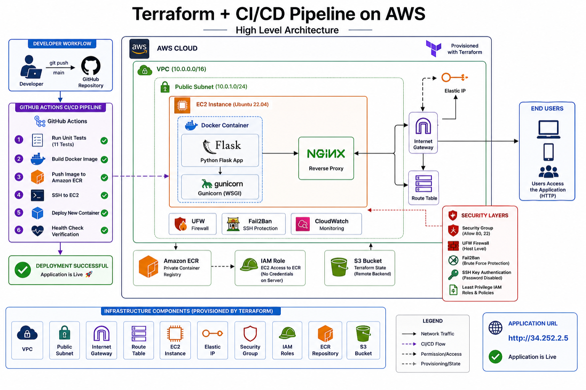

# Production-Grade AWS Infrastructure with Terraform & CI/CD

A fully automated cloud infrastructure platform built on AWS using **Terraform Infrastructure as Code (IaC)** and **GitHub Actions CI/CD**. This project provisions and manages production-ready infrastructure, builds and tests a containerized Flask application, and deploys updates automatically with every push to the main branch.

**Key Result:** Developers only need to push code. Infrastructure, testing, image delivery, and deployment are handled automatically.

---

## Architecture Diagram



## Overview

This project demonstrates modern DevOps practices by combining:

* Infrastructure as Code (Terraform)
* Containerization (Docker)
* Continuous Integration & Continuous Deployment (GitHub Actions)
* AWS Cloud Infrastructure
* Security Hardening
* Automated Testing
* Production Web Hosting

The entire environment is reproducible, version-controlled, and deployable from scratch without manual AWS Console configuration.

---

## Live Environment

**Application URL:** http://34.252.2.5

The deployment pipeline automatically publishes application updates whenever changes are merged into the main branch.

---

## Architecture

```text
Developer
    │
    ▼
GitHub Repository
    │
    ▼
GitHub Actions Pipeline
    │
    ├── Execute Unit Tests
    ├── Build Docker Image
    ├── Push Image to AWS ECR
    └── Deploy to EC2
            │
            ▼
      Docker Container
            │
            ▼
          Gunicorn
            │
            ▼
           Nginx
            │
            ▼
        End Users
```

---

## Technology Stack

| Category                | Technology                                       |
| ----------------------- | ------------------------------------------------ |
| Infrastructure as Code  | Terraform                                        |
| Cloud Platform          | AWS                                              |
| Compute                 | EC2 (Ubuntu 22.04)                               |
| Networking              | VPC, Public Subnet, Internet Gateway, Elastic IP |
| Containerization        | Docker                                           |
| Application Server      | Gunicorn                                         |
| Reverse Proxy           | Nginx                                            |
| Container Registry      | Amazon ECR                                       |
| CI/CD                   | GitHub Actions                                   |
| Backend Application     | Python Flask                                     |
| Remote State Management | Amazon S3                                        |
| Security                | IAM, UFW, Fail2Ban, SSH Hardening                |

---

## Automated Deployment Workflow

Every push to the `main` branch triggers a complete deployment pipeline:

1. Execute automated unit tests
2. Build Docker image
3. Tag image using Git commit SHA
4. Push image to Amazon ECR
5. Connect securely to EC2 via SSH
6. Pull latest image
7. Replace running container
8. Run deployment health checks
9. Serve updated application

### Deployment Guarantees

* Failed tests stop deployment immediately
* Every deployment is traceable through commit hashes
* Immutable Docker image releases
* Consistent deployments across environments
* No manual server access required

Average deployment time: **~75 seconds**

---

## Infrastructure Provisioning

All AWS resources are provisioned and managed through Terraform.

### Provisioned Resources

* Virtual Private Cloud (VPC)
* Public Subnet
* Internet Gateway
* Route Tables
* Elastic IP
* EC2 Instance
* Amazon ECR Repository
* IAM Roles and Policies
* Security Groups
* S3 Remote State Backend

Infrastructure changes are version-controlled and reviewed through Terraform plans before deployment.

```bash
cd terraform

terraform init
terraform plan
terraform apply
```

---

## Security Architecture

Security was treated as a first-class requirement throughout the project.

### Server Security

* SSH key-based authentication only
* Password authentication disabled
* UFW host firewall configuration
* Fail2Ban protection against brute-force attacks
* Principle of least privilege applied to IAM permissions

### Container Security

* Non-root Docker container execution
* Minimal application runtime environment
* Private image registry via Amazon ECR

### Deployment Security

* Secrets stored in GitHub Secrets
* No credentials stored on the server
* EC2 authenticates to ECR using IAM roles
* Secure deployment through encrypted SSH connections

### Web Layer Security

* Nginx reverse proxy
* Security headers
* Basic rate limiting
* Application isolation through containers

---

## Project Structure

```text
terraform-cicd-pipeline/
│
├── terraform/
│   ├── backend.tf
│   ├── providers.tf
│   ├── variables.tf
│   ├── main.tf
│   └── outputs.tf
│
├── app/
│   ├── app.py
│   ├── Dockerfile
│   ├── requirements.txt
│   └── tests/
│       └── test_app.py
│
├── .github/
│   └── workflows/
│       └── deploy.yml
│
└── docs/
    └── ARCHITECTURE.md
```

---

## Engineering Highlights

### Infrastructure as Code

Provisioned cloud resources entirely through Terraform, enabling repeatable and auditable deployments.

### Continuous Delivery

Implemented a fully automated CI/CD pipeline that validates, builds, and deploys application updates without manual intervention.

### Cloud-Native Deployment

Used Docker, ECR, and EC2 to create a production deployment workflow similar to those used in modern engineering teams.

### Security Hardening

Applied multiple security layers across infrastructure, operating system, application, and deployment processes.

### Operational Reliability

Integrated automated health checks and deployment verification to ensure application availability after releases.

---

## Future Enhancements

* HTTPS with Let's Encrypt
* Automated rollback strategy
* Terraform module refactoring
* Multi-environment deployments (Development, Staging, Production)
* Prometheus monitoring
* Grafana dashboards
* Centralized log aggregation
* Blue/Green deployment strategy

---

## Skills Demonstrated

* AWS Cloud Infrastructure
* Terraform
* Infrastructure as Code (IaC)
* CI/CD Pipelines
* GitHub Actions
* Docker
* Linux Administration
* Nginx
* Python Flask
* IAM & Cloud Security
* Automated Testing
* DevOps Engineering
* Production Deployment Practices
